#  SPSS Modeler Flow Hands-on

In diesem Tutorial werden TMS Daten (Traffic Measurement System Data) aus Finnland exploriert, aufbereitet und analysiert. Mittels einer Zeitreihenanalyse wird zudem eine Progose des Verkehrsaufkommen an einer ausgewählten RoadStation vorgenommen. Eine nähere Beschreibung der Daten findet sich unter: https://www.digitraffic.fi/en/road-traffic/lam/

Ziel des Tutorials: Erste Schritte und Vertrautwerden mit Modeler Flows innerhalb von Watson Studio.

___________

___Ausgangssituation___: In Watson Studio wurde bereits ein Analyse-Projekt erstellt und man befindet sich in diesem Projekt.

___________

### 1. Modeler Flow öffnen
Klicke auf den blauen Button: __New asset__ (oben rechts) und wähle dann SPSS Modeler__ aus

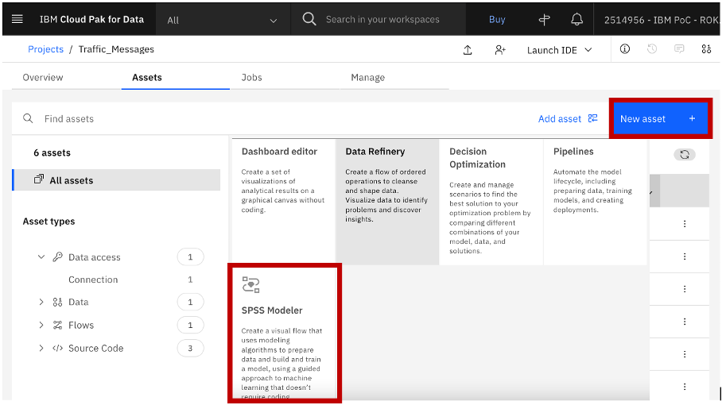

_________

### 2. Vergebe einen Namen für die Analyse und klicke auf __Create__

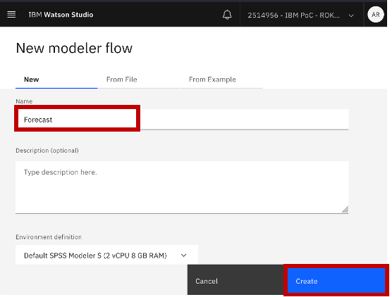

Die GUI von Modeler Flow öffnet sich.

 _________
  

### 3. Datenquelle anbinden
Unter dem Reiter __Import__ findet sich der Knoten __Data Asset__.
Diesen Knoten mit Drag and Drop in den leeren Canvas ziehen und dann mit einem Doppelklick öffnen.

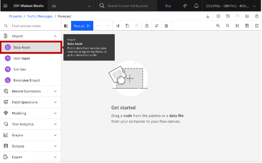

Es öffnet sich der Dateneditor.
Unter dem Reiter __Data asset__ den gewünschten Datensatz auswählen und auf den blauen __Select__-Button drücken.

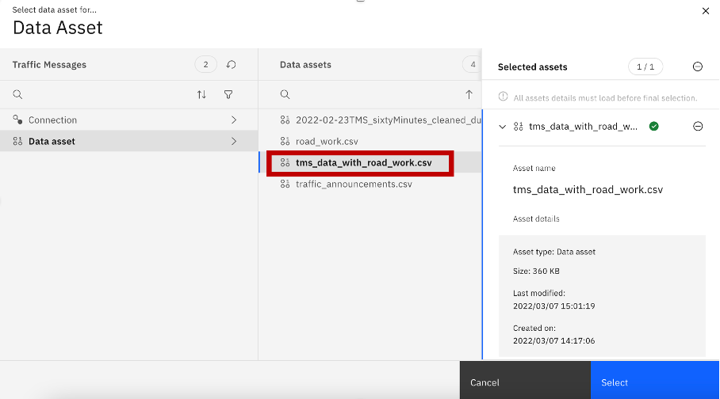

_________

### 3. Daten explorieren
Mit der rechten Maustaste auf den runden Datenasset-Knoten und dann auf __Preview__ klicken. Es öffnet sich eine Vorschau auf die Daten.
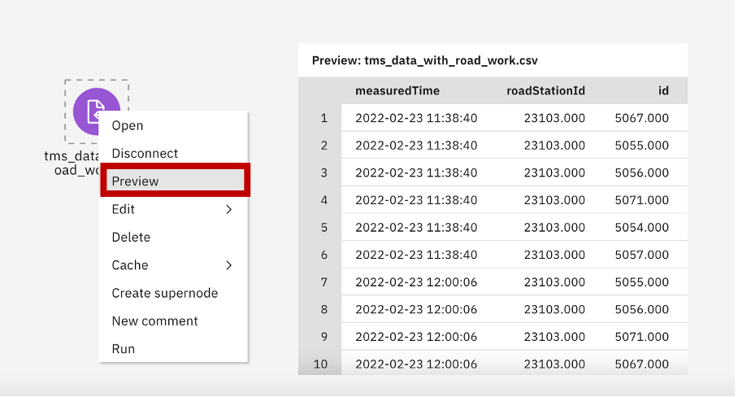

Unter dem Reiter __Graphs__ den __Charts__ Knoten in den Canvas ziehen. Mit der Maustaste über den __Data Asset__-Quellknoten gleiten, bis ein blaues Dreieck erscheint. Das Dreieck anklicken und mittels Drag and Drop zum __Charts__-Knoten ziehen.

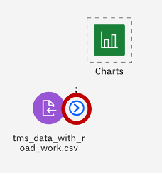

Es entsteht ein Pfeil der beide Knoten miteinander verbindet und die Richtung des Datenflusses visualisiert.

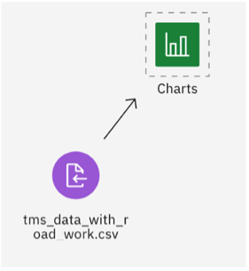

Doppelklick auf den __Charts__-Knoten. Rechts öffnet sich ein Fenster und hier auf den blauen Button __Launch Chart Builder__ klicken

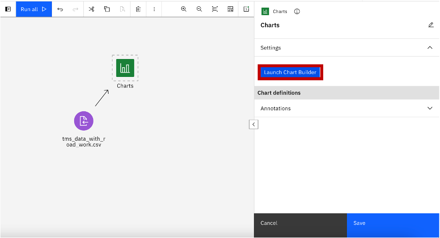

Es öffnet sich die Visualisierungs-Engine.
Eine oder mehrere Variable auswählen und auf __Visualize Data__ klicken. Die Chart-Engine wählt automatisch eine passende Grafik aus.

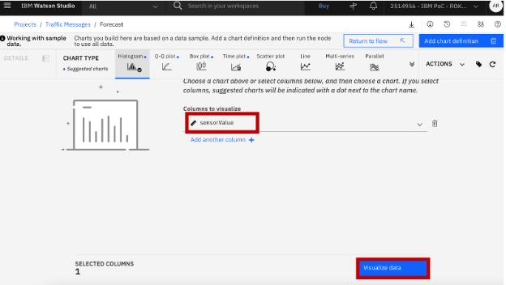

Im Chart Builder stehen 34 Visualsierungsmöglichkeiten zur Verfügung, mit denen man die Daten schnell und intutiv explorieren kann.
Besonders interessant für die später folgende Zeitreihe-Analyse ist der __Timeplot__.

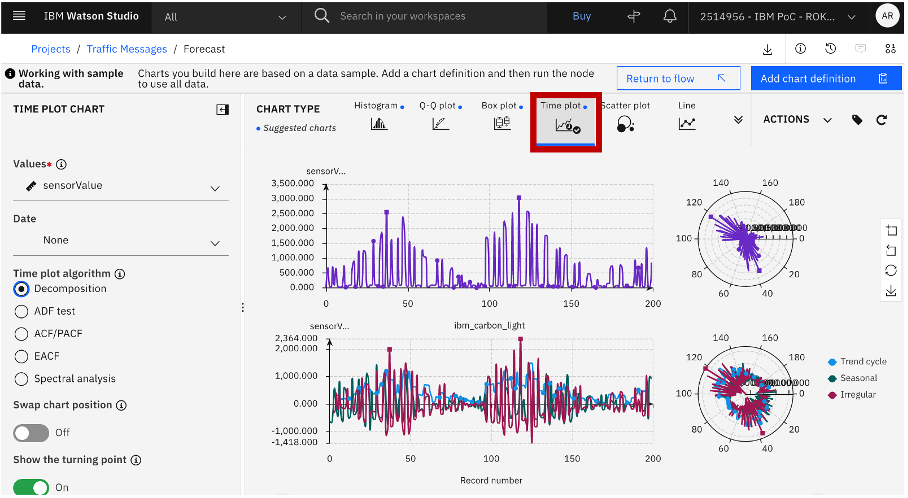

Neben einer Zeitreihen-Zerlegung (Decomposition) werden im __Timeplot__-Chart auch noch wichtige statistische Tests angezeigt – wie zum Beispiel der _ADF-Test_ zum Test der Stationärität einer Zeitreihe und _ACF/ PACF-Plots_ für die Autokorrelation der Lag-Variablen.
_P.S: Im Screenshot sind die Sensorwerte für alle IDs dargestellt, was inhaltlich wenig Sinn macht. Die Grafik dient nur zur Veranschaulichung. Für eine sinnvolle Visualisierung müsste man zuerst auf einzelne IDs selektieren (siehe 4.1)_.

Mit dem Button __Return to flow__ (oben rechts) kommt man wieder zurück zum Modeler Flow.

EXKURS: Weitere Möglichkeit der Datenexploration:
1. __Data Audit Knoten__ (unter Reiter: __Outputs__): liefert statistische Kennzahlen (Mean, Median, Varianz, Schiefe), fehlende Werte, Ausreißer.
(Vorgehen: Knoten in die Oberfläche ziehen, mit Quellknoten verbinden, rechte Maustaste & __Run__, rechts unter _Outputs & Models_ den Data Audit Button anklicken)
2. __Entscheidungsbäume__: Hierbei handelt es sich um komplexere Verfahren, die es jedoch ermöglichen unbekannte Muster und Strukturen in den Daten zu explorieren. Beipiele: __CHAID__ oder __C&RT__ (unter dem Reiter __Modeling__)

______________

### 4. Daten aubereiten

#### 4.1 Selektion ID

Zunächst selektieren wir die Datensätze für das stündliche Verkehrsaufkommen (ID 5054).
Hierfür ziehen wir einen __Select__-Knoten aus dem Reiter __Record Operations__ in die Modeler-Oberfläche und verbinden den Knoten mit dem Quellknoten.

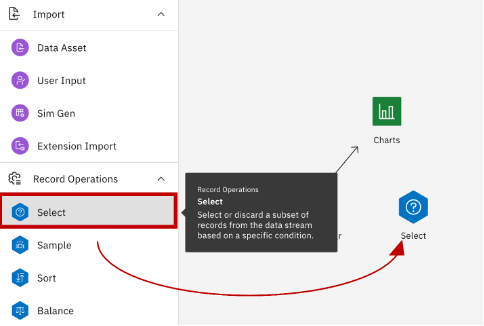

Danach Doppelklick auf den Select-Knoten. Es öffnet sich rechts das Fenster mit den Knoteneinstellungen. Im grau markierten Eingabebereich tippen wir folgende Formel ein: ___id = 5054___: und drücken auf den __Save__-Button.

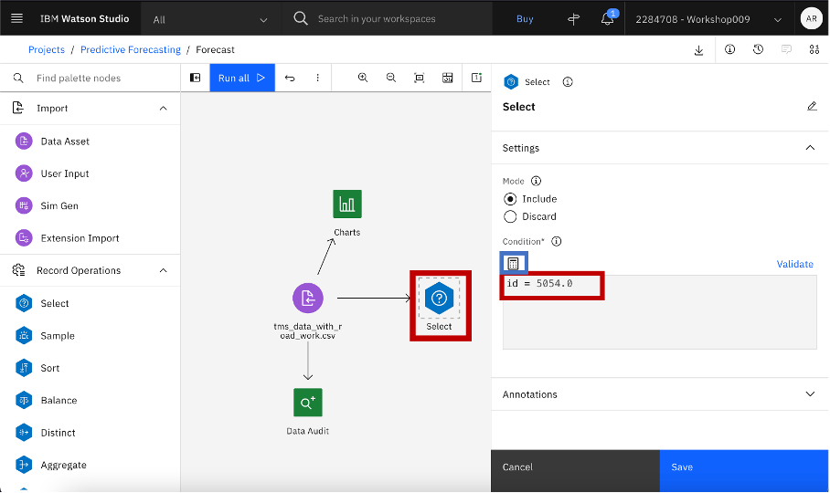

Mit einer Vorschau auf den Select-Knoten (rechte Maustaste => Preview) kann man überprüfen, ob die Selektion funktioniert hat.

Komplexere Datenselektierungsoperationen können mit dem sog. _Expression Builder_ ausgeführt werden. Hierzu klickt man auf das Taschenrechnersymbol im Einstellungsknoten.

#### 4.1 Selektion Roadstation-ID

Im nächsten Schritt selektieren wir eine Roadstation-ID, für die wir im Anschluss ein Forecasting-Model des Verkehrsaufkommens berechnen werden.
Hierzu ziehen wir einen weiteren Select-Knoten in den Modeler Stream (Reiter __Record Operations__) und verbinden diesen mit dem vorher benutzen ID-Select Knoten. Dann: Doppelklick auf den neuen Select-Knoten und Eingabe folgender Formel: ___roadStationId = 23140___. Plus: __Save__. 

Um die Operation zu überprüfen, ziehen wir dieses Mal einen __Table__-Knoten unter dem Reiter __Outputs__ in die Oberfläche und führen die Tabelle aus (rechte Maustaste und __Run__). Im Output-Fenster, das rechts aufpoppt, klickt man auf die Tabelle, wodurch diese sich öffnet.

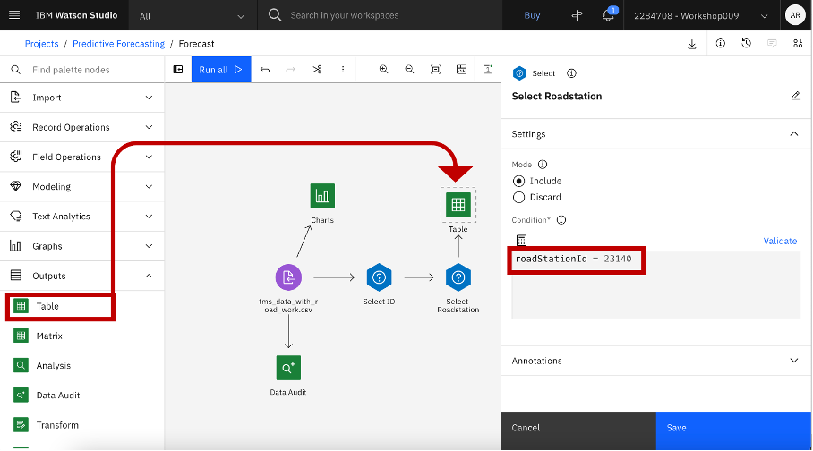

Damit haben wir einen aufbereiteten Datensatz für die Modellierung einer Zeitreihe.

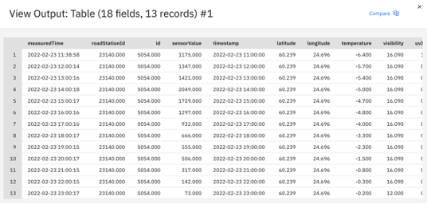

Mehr Infos zur Datenaufbereitung und den einzelnen Operationen findet man unter folgenden Links: 

Record Operations: https://dataplatform.cloud.ibm.com/docs/content/wsd/nodes/_nodes_record_operations.html

Field Operations: https://dataplatform.cloud.ibm.com/docs/content/wsd/nodes/_nodes_field_operations.html

____________

### 4. Modellierung

Vor der eigentlichen Modelierung ziehen wir einen __Type__-Knoten aus dem Reiter __Field Operations__ in den Canvas und öffnen diesen mit einem Doppelklick. Im Type-Knoten klicken wir auf den blauen Button __Read values__. Damit wird der Modeler-Stream "instanziert". Das heißt: alle Datenwerte werden eingelesen und das Skalenniveau und der Datentyp für die einzelnen Variablen werden  automatisch bestimmt. Danach drücken wir den blauen __Save__-Button.

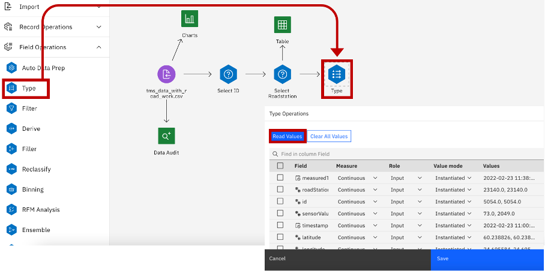

_P.S: 80% aller Fehlermeldungen im Modeler lassen sich lösen, indem man einen Type-Knoten in den Canvas zieht und den Modeler Stream neu instanziert._

Jetzt können wir mit der __Modellierung__ endlich beginnen!

Hierzu ziehen wir hinter dem Type-Knoten einen __Time Series__-Knoten aus dem Reiter __Modeling__ in die Oberfläche und öffnen diesen mit einem Doppelklick.
Im Knoten setzen wir ein Häcken bei __Use custom field roles__, damit wir manuell die relevanten Zielvariablen auswählen können. Dann klicken wir auf den blauen Button __Add columns +__  und setzen ein Häcken bei der Variable ___sensorValue___, welche inhaltlich das stündliche Verkehrsaufkommen beschreibt. Unsere Auswahl bestätigen wir unten mit __Ok__. Damit haben wir unsere Zielvariable bestimmt. Unter __Candidate Inputs__ könnte man noch externe Faktoren in die Zeitreihenanalyse einfließen lassen.

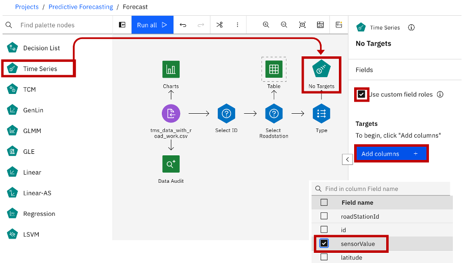

Danach scrollen wir in den Einstellungen weiter nach unten zum Reiter __Observations and Time Intervall__, in deo wir die für die Analyse relevante Zeitvariable und das Zeitintervall definieren. 
In unserem Fall sind das:
- Time/Date Field: Variable __"timestamp"__
- Time Interval: __"Hours per day"__

Weiter unten im Reiter Build Options kann man die gewünschten Zeitreihenalgorithmen konfigurieren.
Wir belassen es bei den Standard-Einstellungen, bei denen der sog. __Expert Modeler__ benutzt wird, der alle Zeitreihenverfahren (ARIMA sowie Verfahren des exponentiellen Glättens) automatisch durchrechnet und das am besten performende Model bestimmt.

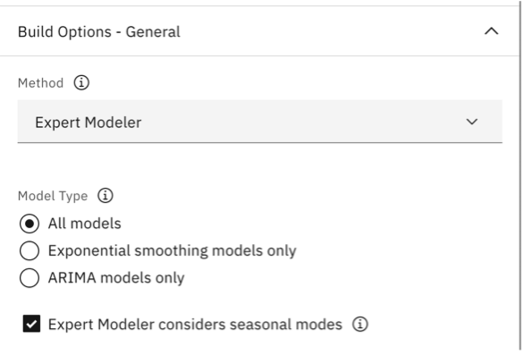

Weiter unten im Reiter __Model Options__ nehmen wir die letzte Konfiguration vor.
Wir definieren, wie lange das Modell in die Zukunft prognostizieren soll. Dafür setzen wir ein Häkchen beim Punkt _Extend records into the future_ und legen darunter die Anzahl der prognostizierten Stunden fest – im vorliegenden Szenario wähle ich drei Stunden.

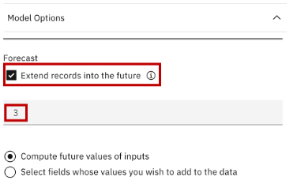

Wir speichern unsere Einstellungen, indem wir unten den blauen __Save__-Button drücken.

Jetzt führen wir das Zeitreihenmodell aus. Rechte Maustaste auf den Time Series Knoten und __Run__.

Es erscheint ein fünfeckiges, brauner Modellknoten, den wir mit rechter Maustaste und __View Model__ öffnen können.
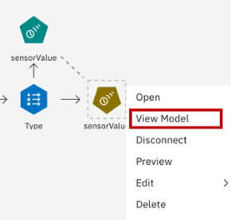

Es öffnet sich die Modellübersicht:

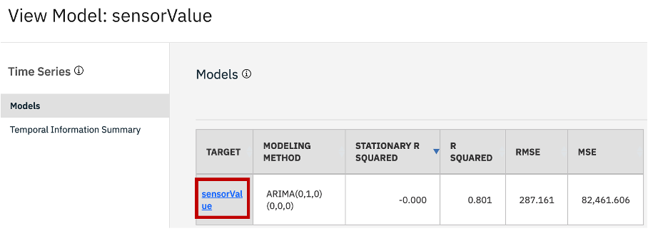

#### 5. Evaluation
Der Modellübersicht können wir entnehmen, dass in der vorliegenden Zeitreihe das ARIMA-Modell das beste Zeitreihenverfahren ist.
Wenn man auf den blau markierten Hyperlink __sensorValue__ klickt, dann bekommt man noch viele weitere Modellgüteparameter angezeigt.

Um die Zeitreihe und die Vorhersage des ARIMA Models zu visualsieren, ziehen wir unter dem Reiter __Graphs__ den __Time plot__-Outputknoten in den Canvas und öffnen diesen.

Wir markieren den Punkt __Selected Time Series models__ und klicken auf den blauen __Add columns__-Button. Dann setzen wir ein Häkchen bei der $TS-Variable. Hierbei handelt es sich um die Variable, welche die Vorhersagewerte des ARIMA Models beinhaltet.

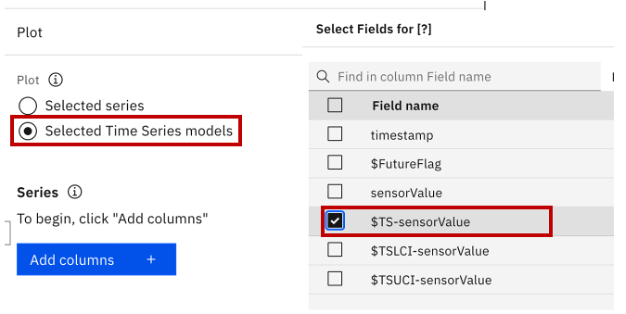

Danach speichern wir unsere Einstellungen (__Save__) und führen den Time plot-Knoten aus (rechte Maustaste & __Run__).

Im Timeplot stehen die roten Punkte für die historischen Datenpunkte. Die Linie beschreibt das ARIMA-Modell inklusive den drei vorhergesagten Werten. Der blaue Korridor visualisiert das Konfidenzintervall – also: wie sicher ist sich das Modell in Bezug auf seine Verhersage. Je breiter, desto unsicherer.

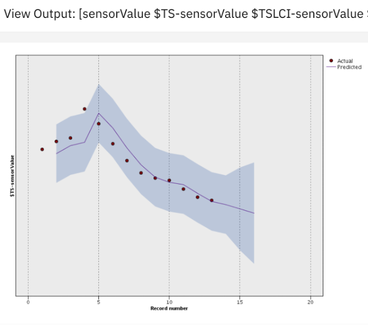

Die  Vorhersagewerte können mit einem __Table__-Knoten angeschaut und ggf. in eine Textdatei oder eine Datenbank exportiert werden (Reiter: Export).

__________

Hier endet unser Tutorial, das nur einen kleinen Einblick in die Funktionalitäten des Modelers geben konnte.

_P.S. Neben der klassischen Zeitreihen-Analyse bietet der Modeler auch noch eine Vielzahl an Machine Learning Algorithmen (z.B. XGBoost, Random Forest etc.), mit denen man auch eine Vorhersage des zukünftigen Verkehrsaufkommen bewerkstelligen könnte._

__________

Weiterführende Informationen:

Modeler Flow Knowledge Center: https://dataplatform.cloud.ibm.com/docs/content/wsd/spss-modeler.html

Neben einer Eräuterung einzelner Modeler-Knoten findet man hier noch zahlreiche, weitere Tutorials.
