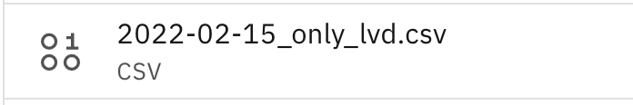
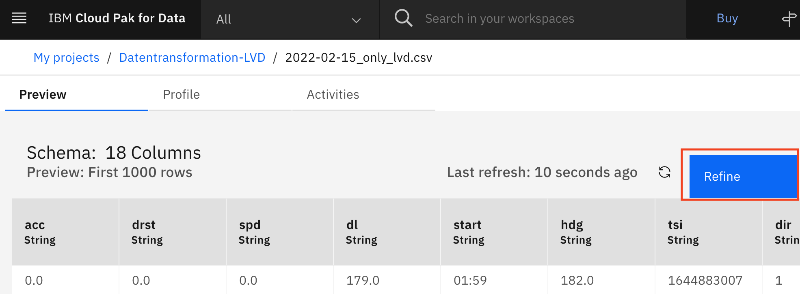
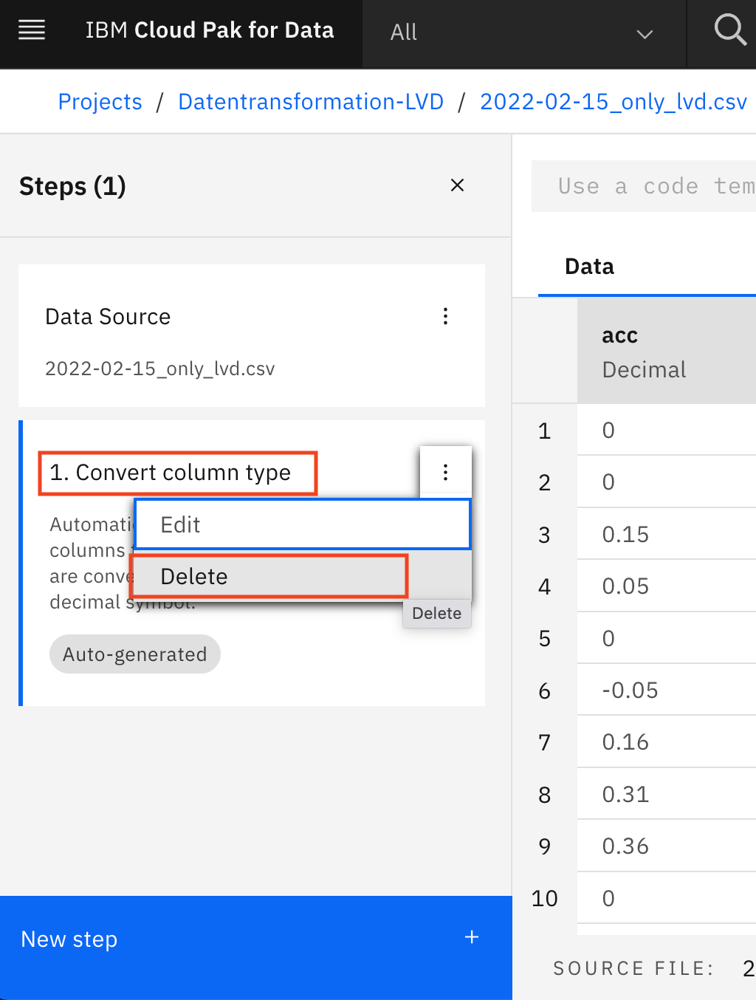
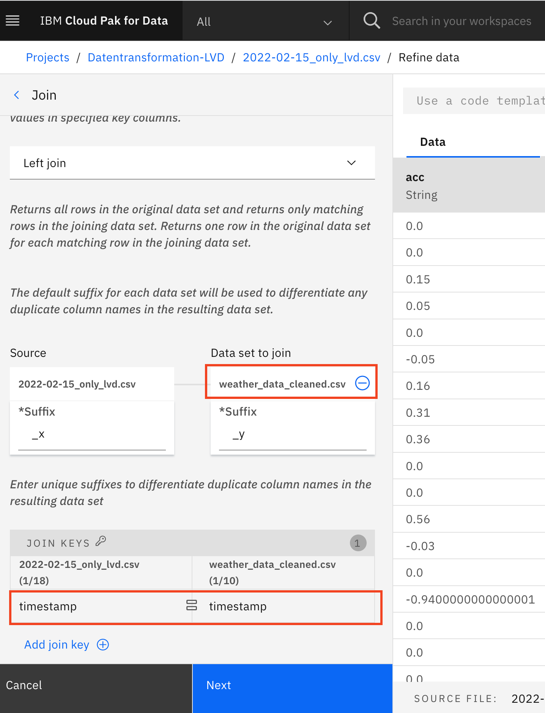
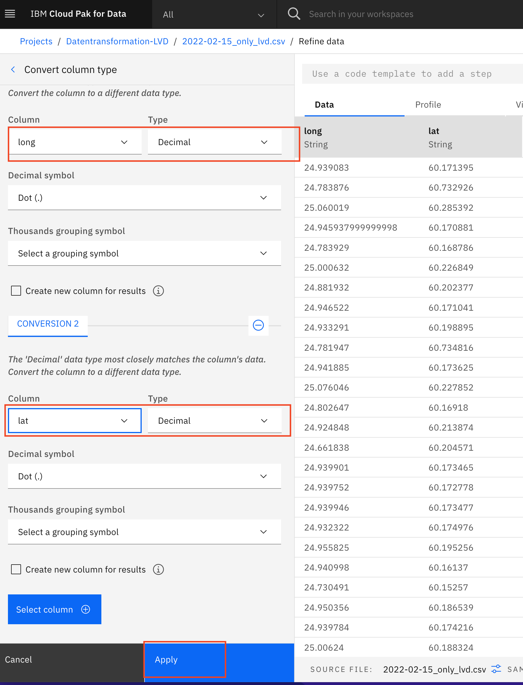
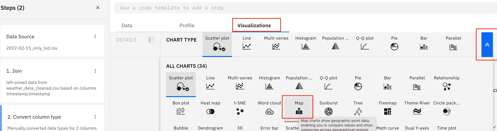
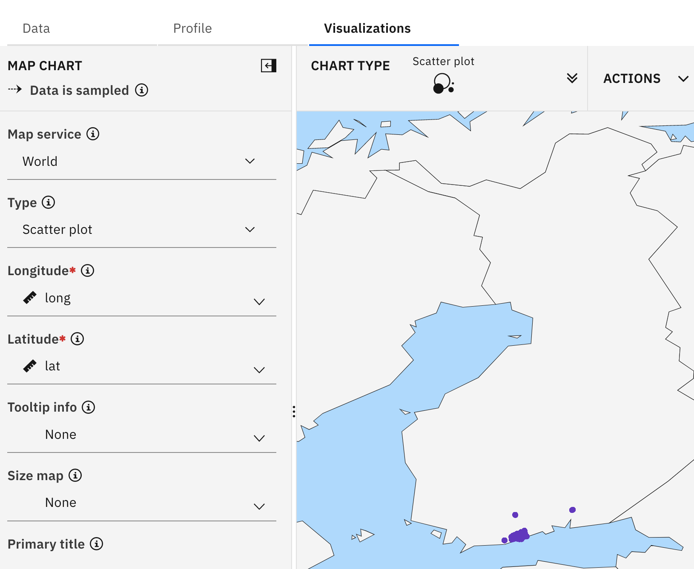
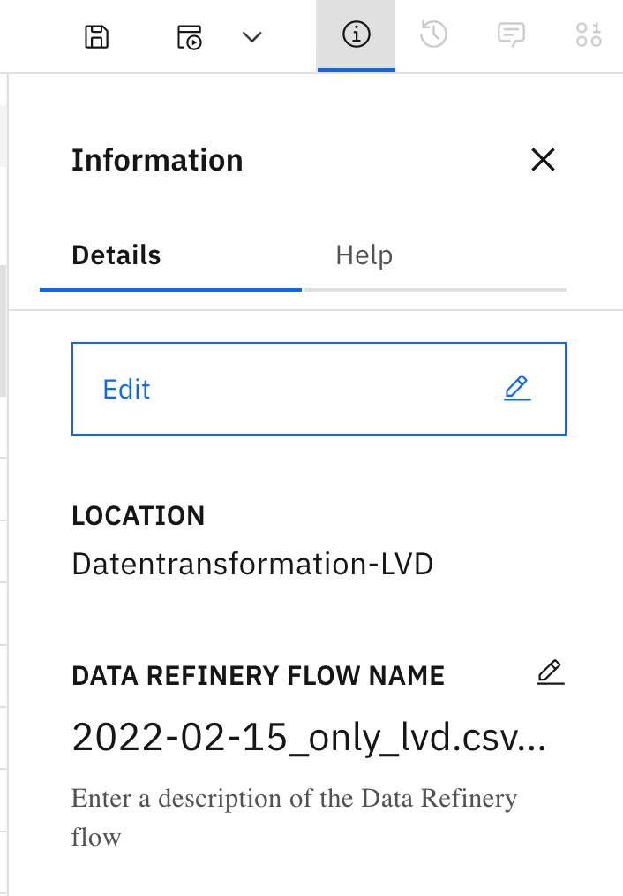
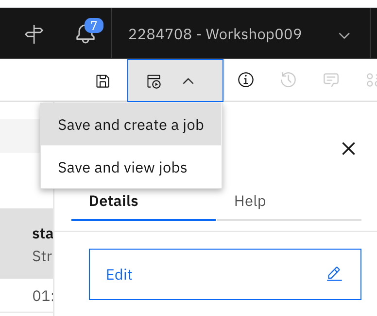

1. Datei, die aufbereitet werden soll öffnen<br>
Öffne Dataset "2022-02-15_only_lvd.csv"<br>

1. Dataset bearbeiten<br>
Wähle "Refine" rechts oben<br>

Anm.: Wenn die Sprache im Browser auf Deutsch gestellt ist, wird hier "Verfeinern" angezeigt
3. Einstieg in Refinery<br>
Refinery führt im Hintergrund ein Sampling und Profiling der Daten durch, dies dauert eine Weile.
Sobald refinery bereit ist, wird zuerst den automatisch eingeführte Schritt "Convert Cloumn Type" entfernen.

4. Join<br>
- Schritt einfügen<br>
Für den Join wird ein neuer Schritt "mittels "New Step" hinzugefügt
Aus den verfügbaren Schritten entweder nach untenscrollen bis "Join" erreicht ist, oder in das Suchfeld oben "Join" eingeben.
- Wetterdaten hinzufügen<br>
Aus den verfügbaren Daten Im Projekt wähle "weather_data_cleaned.csv"
- Joinkriterium<br>
Für beide Tabellen wähle "timestamp" als Join Key

- Abschließen<br>
Weiter mit "Next"
Im nächsten Schritt können die Spalten abgewählt werden, die nicht im Ergebnis landen sollen - für jetzt die Auswahl beibehalten.
Weiter mit "Apply" - Der Join Schritt ist fertig
5. [Optional] Daten Visualisieren<br>
Häufig hilft bei der Aufbereitung einen Überblick über die daten zu bekommen, die lässt sich mit der integrieten Visualisierungsengine bewerkstelligen.
- Koordinaten von Text nach Decimal ändern
"New step" --> "Convert column type"
Wähle Spalten "lat", "lon" und wandle sie von Text in Decimal
Weiter mit "Apply"

- Visualisierung einfügen
"Map" Visualisierung einfügen: "Visualizations" --> "Map"

Wähle:
Mapservice = "World"
Longitude = lon
latitude = lat

Unter "Actions" lässt sich die visualisierung abspeichern - dies ist für jetzt nicht notwendig.
6. Ausgabedatei definieren<br>
Per default wird die Ausgabe in einem Dataset gleich names jedoch mit dem Suffix "shaped" gespeichert, die lässt sich aber anpassen.
Im "Info Pane" wähle Details --> Edit"
Wähle "Edit Output"
Ändere Den Namen in \<origname>\<your-id>_shaped

7. Refinery Flow Speichern<br>
Nachdem die Daten aufbereitet wurden speichern wir den Flow. Der Flow Name lässt sich auch auf dem Info Pane ändern - auch hier den Default Namen mit einem Nutzerspezifischen Suffix erweitern.
8. Flow ausführen <br>
Mit "Save and create job" lässt sich der flow direkt ausführen. 

Der Job wird dann auf alle daten aus den Quellen angewendet nicht nur auf einem Sample wie während des interaktiven Designs.
- Namen des Jobs angeben (Notwendig um den Job später zu identifizieren)
- Wahl der Umgebung die verwendet werden soll  - hier genügt es den Default XS zu nehmen
- Schedule auf off belassen. Hier währe die Möglichkeit einen Zeitpunkt oder eine wiederholte Ausführung zu wählen.
- Benachrichtigungen aus
- Zusammenfassung prüfen und mit "Create" die Jobausführung starten
9. Abschluss<br>
Das Ergebnis des Refinery Laufs kann im Projekt überprüft werden.


```python

```
